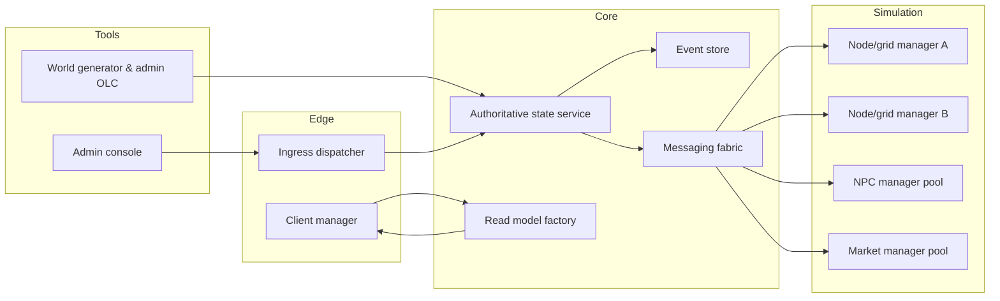
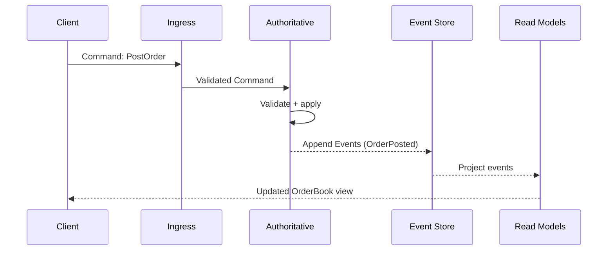
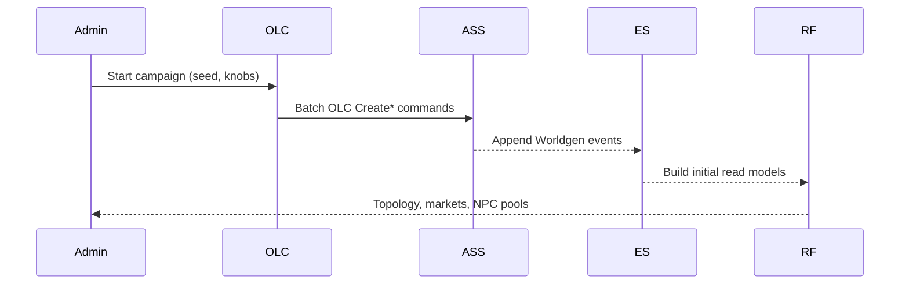

---

## Architecture overview

- **Authoritative state service:** Single source of truth with CQRS + event sourcing; validates commands, emits events, resolves conflicts.
- **Node/grid managers:** Localized simulation ticks per region; consume snapshots; emit commands; migrate actors between nodes.
- **NPC managers:** Plan and produce actions from the NPC Decision API; impulse-aware; partitioned by faction/geography.
- **Market managers:** Maintain localized order books, taxation, escrow, black markets; settle trades as authoritative commands.
- **Ingress dispatcher:** Authenticates and routes client/admin actions to correct domain/aggregate.
- **Client manager:** Serves HTML5 client and websockets; subscribes to read models; can be independent or co-located with nodes.
- **DAL & read models:** Event store for writes; projections/materialized views for queries; schema-validated.
- **Messaging fabric:** Typed topics for commands/events/snapshots; ordered per aggregate; sagas for multi-step workflows.
- **World generator (OLC):** Deterministic, replayable creation via the same command/event pipeline used for admin operations.

---

## Diagrams

### High-level component diagram



### CQRS + event sourcing flow



### World generation via OLC



---

## Data contracts and command/event schema

### Command envelope

```rust
use serde::{Deserialize, Serialize};

#[derive(Debug, Serialize, Deserialize)]
pub struct Causality {
    pub actor_id: String,
    pub grid_id: Option<String>,
    pub tick: u64,
}

#[derive(Debug, Serialize, Deserialize)]
pub struct Command<T> {
    pub aggregate_id: String,
    pub payload: T,
    pub causality: Causality,
}
```

### Market commands/events

```rust
#[derive(Debug, Serialize, Deserialize)]
pub enum MarketCmd {
    PostOrder {
        order_id: String,
        station_id: String,
        side: OrderSide, // Buy/Sell
        good: String,
        quantity: i64,
        price: f32,
        taxes: Taxes, // computed/validated server-side
    },
    CancelOrder { order_id: String, station_id: String },
    MatchTick { station_id: String },
}

#[derive(Debug, Serialize, Deserialize)]
pub enum MarketEvt {
    OrderPosted { order_id: String, station_id: String },
    OrderCanceled { order_id: String, station_id: String },
    OrderMatched {
        buy_order_id: String,
        sell_order_id: String,
        station_id: String,
        quantity: i64,
        price: f32,
        fees_settled: FeesSettlement,
    },
}
```

### Taxes/fees and settlement structs

```rust
#[derive(Debug, Serialize, Deserialize)]
pub enum OrderSide { Buy, Sell }

#[derive(Debug, Serialize, Deserialize)]
pub struct Taxes {
    pub imperial: f32,   // e.g., 0.02
    pub house: f32,      // varies by standing
    pub steward: f32,
    pub station: f32,
    pub facility: f32,
}

#[derive(Debug, Serialize, Deserialize)]
pub struct FeesSettlement {
    pub total_fee: i64,
    pub breakdown: Vec<(String, i64)>, // ("imperial", 50), ("house", 100), ("station", 50)
}
```

### NPC commands/events (example)

```rust
#[derive(Debug, Serialize, Deserialize)]
pub enum NpcCmd {
    CommitPlan { npc_id: String, plan: serde_json::Value },
}

#[derive(Debug, Serialize, Deserialize)]
pub enum NpcEvt {
    PlanCommitted { npc_id: String, utility: f32, rationale: String },
}
```

### OLC worldgen commands

```rust
#[derive(Debug, Serialize, Deserialize)]
pub enum OlcCmd {
    CreateFaction { id: String, ideology: String },
    CreateStation { id: String, faction: String, grid: String },
    CreateMarket { station: String, goods: Vec<String> },
    CreateNpcPool { faction: String, count: usize },
    ApplyImpulse { id: String, scope: String, payload: serde_json::Value },
}
```

---

## Authoritative state service and aggregates

### Command handler trait and event emission

```rust
use serde::{Deserialize, Serialize};
use thiserror::Error;

#[derive(Debug, Error)]
pub enum AssError {
    #[error("conflict")]
    Conflict,
    #[error("invalid command: {0}")]
    Invalid(String),
}

pub trait CommandHandler {
    type Cmd: Serialize + for<'de> Deserialize<'de>;
    type Evt: Serialize + for<'de> Deserialize<'de>;
    fn handle(&mut self, cmd: Command<Self::Cmd>) -> Result<Vec<Event<Self::Evt>>, AssError>;
}

#[derive(Debug, Serialize, Deserialize)]
pub struct Event<T> {
    pub aggregate_id: String,
    pub payload: T,
    pub version: u64,
    pub ts: u64,
}
```

### Order book aggregate (simplified)

```rust
#[derive(Debug, Default)]
pub struct OrderBook {
    pub station_id: String,
    pub bids: Vec<Order>,
    pub asks: Vec<Order>,
    pub version: u64,
}

#[derive(Debug, Clone, Serialize, Deserialize)]
pub struct Order {
    pub id: String,
    pub side: OrderSide,
    pub good: String,
    pub quantity: i64,
    pub price: f32,
}

impl OrderBook {
    fn post(&mut self, cmd: &MarketCmd) -> Result<Event<MarketEvt>, AssError> {
        if let MarketCmd::PostOrder { order_id, station_id, side, good, quantity, price, .. } = cmd {
            if &self.station_id != station_id { return Err(AssError::Invalid("station mismatch".into())); }
            let o = Order { id: order_id.clone(), side: side.clone(), good: good.clone(), quantity: *quantity, price: *price };
            match side {
                OrderSide::Buy => self.bids.push(o),
                OrderSide::Sell => self.asks.push(o),
            }
            Ok(Event {
                aggregate_id: self.station_id.clone(),
                payload: MarketEvt::OrderPosted { order_id: order_id.clone(), station_id: station_id.clone() },
                version: self.version + 1, ts: now(),
            })
        } else { Err(AssError::Invalid("not a post order".into())) }
    }

    fn match_tick(&mut self) -> Vec<Event<MarketEvt>> {
        self.bids.sort_by(|a, b| b.price.partial_cmp(&a.price).unwrap());
        self.asks.sort_by(|a, b| a.price.partial_cmp(&b.price).unwrap());
        let mut i = 0; let mut j = 0; let mut evts = vec![];
        while i < self.bids.len() && j < self.asks.len() {
            let (buy, sell) = (&mut self.bids[i], &mut self.asks[j]);
            if buy.price >= sell.price && buy.good == sell.good {
                let qty = buy.quantity.min(sell.quantity);
                let price = (buy.price + sell.price) / 2.0;
                buy.quantity -= qty; sell.quantity -= qty;
                evts.push(Event {
                    aggregate_id: self.station_id.clone(),
                    payload: MarketEvt::OrderMatched {
                        buy_order_id: buy.id.clone(), sell_order_id: sell.id.clone(),
                        station_id: self.station_id.clone(), quantity: qty, price,
                        fees_settled: settle_fees(qty, price),
                    },
                    version: self.version + 1, ts: now(),
                });
                if buy.quantity == 0 { i += 1; }
                if sell.quantity == 0 { j += 1; }
            } else { break; }
        }
        evts
    }
}

fn now() -> u64 { 0 }

fn settle_fees(quantity: i64, price: f32) -> FeesSettlement {
    let total = (quantity as f32 * price * 0.08) as i64; // sample 8% blended
    FeesSettlement {
        total_fee: total,
        breakdown: vec![("imperial".into(), total / 4), ("house".into(), total / 2), ("station".into(), total / 4)],
    }
}
```

---

## Node/grid simulation and client delivery

### Grid tick trait and snapshot

```rust
#[derive(Debug, Serialize, Deserialize)]
pub struct GridSnapshot {
    pub grid_id: String,
    pub actors: Vec<ActorPresence>,
    pub local_markets: Vec<String>, // station ids
}

#[derive(Debug, Serialize, Deserialize)]
pub struct ActorPresence {
    pub actor_id: String,
    pub pos: (i32, i32),
    pub faction: String,
}

pub trait GridTick {
    fn snapshot(&self) -> GridSnapshot;
    fn plan(&mut self, snap: &GridSnapshot) -> Vec<Command<serde_json::Value>>;
}
```

### Client manager interfaces

```rust
pub trait Session {
    fn subscribe(&self, topic: &str);
    fn send_delta(&self, payload: &[u8]);
}

pub struct ClientManager;
impl ClientManager {
    pub fn serve_orderbook(&self, station_id: &str, read: &ReadModels) {
        let view = read.orderbook(station_id);
        let payload = serde_json::to_vec(&view).unwrap();
        // send to subscribed sessions
        // ...
    }
}
```

---

## Managers and sagas

### NPC and market manager traits

```rust
pub struct ReadModels {
    // Facades to query projections: standings, order books, contracts, grids
}

pub trait NpcPlanner {
    fn plan(&self, npc_id: &str, read: &ReadModels) -> Vec<Command<serde_json::Value>>;
}

pub trait MarketEngine {
    fn settle(&self, station_id: &str, read: &ReadModels) -> Vec<Command<MarketCmd>>;
}
```

### Contract settlement saga (escrow → resolution → reputation)

```rust
#[derive(Debug, Serialize, Deserialize)]
pub enum ContractSagaEvt {
    EscrowDeposited { esc_id: String, contract_id: String },
    DeliveryVerified { contract_id: String },
    AssetsReleased { esc_id: String },
    ReputationAdjusted { actor_id: String, delta: i32 },
}

pub fn contract_saga_step(evt: ContractSagaEvt) -> Vec<Command<serde_json::Value>> {
    match evt {
        ContractSagaEvt::EscrowDeposited { esc_id, contract_id } =>
            vec![cmd_verify_delivery(contract_id)],
        ContractSagaEvt::DeliveryVerified { contract_id } =>
            vec![cmd_release_assets(contract_id)],
        ContractSagaEvt::AssetsReleased { esc_id } =>
            vec![cmd_adjust_reputation_for_parties(esc_id, +200)], // example
        ContractSagaEvt::ReputationAdjusted { .. } => vec![],
    }
}

fn cmd_verify_delivery(contract_id: String) -> Command<serde_json::Value> { /* ... */ unimplemented!() }
fn cmd_release_assets(contract_id: String) -> Command<serde_json::Value> { /* ... */ unimplemented!() }
fn cmd_adjust_reputation_for_parties(_esc_id: String, _delta: i32) -> Command<serde_json::Value> { /* ... */ unimplemented!() }
```

---

## World generator integration

### Worldgen trait and batch execution

```rust
pub trait WorldGenerator {
    fn generate(&self, seed: u64, knobs: serde_json::Value) -> Vec<Command<OlcCmd>>;
}

pub struct DefaultWorldGen;
impl WorldGenerator for DefaultWorldGen {
    fn generate(&self, seed: u64, _knobs: serde_json::Value) -> Vec<Command<OlcCmd>> {
        let cmds = vec![
            Command {
                aggregate_id: "world".into(),
                causality: Causality { actor_id: "system".into(), grid_id: None, tick: 0 },
                payload: OlcCmd::CreateFaction { id: "house_keitel".into(), ideology: "expansionist".into() },
            },
            Command {
                aggregate_id: "station_keitel_prime".into(),
                causality: Causality { actor_id: "system".into(), grid_id: Some("grid_north".into()), tick: 0 },
                payload: OlcCmd::CreateStation { id: "station_keitel_prime".into(), faction: "house_keitel".into(), grid: "grid_north".into() },
            },
        ];
        cmds
    }
}
```

---

## DAL and projections

### Event store and read model traits

```rust
pub trait EventStore {
    fn append<T: Serialize>(stream: &str, events: &[Event<T>]) -> anyhow::Result<()>;
    fn load<T: for<'de> Deserialize<'de>>(stream: &str) -> anyhow::Result<Vec<Event<T>>>;
}

pub trait Projector {
    fn apply<T: for<'de> Deserialize<'de>>(&mut self, event: &Event<T>);
}
```

### Example: order book projection for UI

```rust
#[derive(Debug, Serialize, Deserialize)]
pub struct OrderBookView {
    pub station_id: String,
    pub bids: Vec<(f32, i64)>, // price, quantity
    pub asks: Vec<(f32, i64)>,
    pub last_trade: Option<(f32, i64)>,
}

pub struct OrderBookProjector {
    pub views: std::collections::HashMap<String, OrderBookView>,
}

impl Projector for OrderBookProjector {
    fn apply<T: for<'de> Deserialize<'de>>(&mut self, event: &Event<T>) {
        if let Ok(MarketEvt::OrderMatched { station_id, price, quantity, .. }) =
            serde_json::from_value::<MarketEvt>(serde_json::to_value(&event.payload).unwrap())
        {
            let v = self.views.entry(station_id.clone()).or_insert(OrderBookView {
                station_id: station_id.clone(), bids: vec![], asks: vec![], last_trade: None
            });
            v.last_trade = Some((price, quantity));
        }
    }
}
```

---

## Operational considerations

- **Horizontal scaling:** Shard aggregates by domain key (station_id, grid_id, faction_id). Scale NGM pools per-grid; assign affinity for actors.
- **Determinism:** Seeded RNG per aggregate/tick to replay outcomes; versioned events; idempotent commands.
- **Backpressure:** Bounded queues; priority lanes for admin impulses; node autoscaling based on tick backlog.
- **Integrity & anti-cheat:** Signature verification at ingress; authoritative validation; rate limiting; policy gates for risky operations.
- **Observability:** Tracing spans per command/event; audit trails; dashboards for market health, suspicion scores, contract throughput.
- **Config & feature flags:** Campaign knobs and staged rollouts for economy aggressiveness, espionage risk, tax rates, etc.

---

## Next steps

- **Create Rust workspace:** Crates for bus, authoritative, managers (npc/market), node, ingress, dal, client, worldgen.
- **Implement minimal end-to-end:** PostOrder → OrderMatched → projection → client broadcast.
- **Add OLC bootstrap:** Feed worldgen batch into ASS at campaign start; verify projections.
- **Wire managers:** Market match loop and a simple NPC planner emitting a benign plan.
- **Testing:** Unit tests for order matching, fee settlement, escrow saga; scenario tests for layered contracts with reputation pledges.

